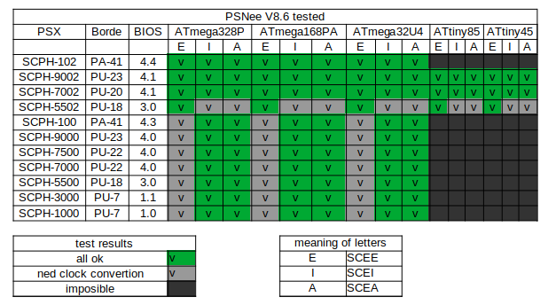

# PSNee V8.6
THE modechip supports the largest number of Playstation 1 variants, and the largest number of microcontrollers

## Installation
For all useful information consult the Wiki

## Features
- Remove Disk Region Protection
- Patch BIOS additional region features
- A specific library for card support, to solve the fuse setting problem.
- The mode does not take care of changing PAL <-> NTSC video output (in other words if you use a Japanese console and you put European or American games the display will not be correct)

## Supported Playstation 1
All US models, all European models, and the vast majority of Japanese models.

## Supported platforms
- ATmega328(A/P/PA) @16Mhz  
- ATmega168(A/P/PA) @16Mhz
- Atmega32U4        @16Mhz
- ATtiny25/45/85    @8Mhz no BIOS patch!

## Model tested

P.S. I don't have an American model, or SCPH_xxx3. If you have tested it, tell me.
