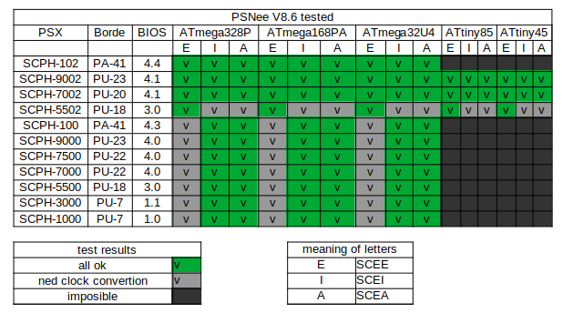

# PSNee V8.6
THE modechip supports the largest number of Playstation 1 variants, and the largest number of microcontrollers
# For all useful information consult the 

## Features
- Remove Disk Region Protection
- Patch BIOS 
- A specific library for card support, to solve the fuse setting problem.
- Hardware Reset Synchronization (Forced Boot Sync): Solves the "race condition" where the console starts faster than the PsNee.
The MCU holds the console in reset until it is fully initialized, ensuring a better success rate on cold boots.
Critical for PSOne (SCPH-102), Japanese models, and known problematic boards using the ATmega328PB.
- Bootloader Friendly: This sync mechanism allows you to keep the standard bootloader, making it easier to update without extra hardware (ISP).
- The PsNee does not take care of changing PAL <-> NTSC video output (in other words if you use a Japanese console and you put European games, or in older European models you use American or Japanese games... the display will not be correct). This is normal. You can either use patches or an RGB cable.

> [!CAUTION]
>## Forced Boot Sync Implementation
> This section applies only if you enable the hardware-level reset synchronization (e.g., ENABLE_HOLD_RESET_ON_BOOT) for improved stability.
>### Critical Wiring Warning
> **DO NOT connect the console's Reset point to the Arduino’s physical RST pin.**
> Reason: This creates a feedback loop. When the Arduino pulls the line LOW to sync the console, it would simultaneously trigger its own physical reset. This causes the MCU to restart before finishing the sync pulse, leading to an infinite reset cycle.
> Correct Connection:
> - ATmega328/168 (Nano, Uno): Connect console Reset to D10.
> - ATmega32u4 (Pro Micro, Leonardo): Connect console Reset to A0.
>#### Manual Reset Behavior
> Known Limitations: While cold boot BIOS patching is highly reliable, manual resets remain "hit & miss" on Japanese FAT boards due to potential residual hardware states. A full power cycle is still recommended for best reliability on these models.
>#### Bootloader Preservation
>This mechanism allows you to safely keep the standard Arduino bootloader. You can perform real-time BIOS patching without needing to flash the AVR via ISP, making future updates much easier.

## Supported Playstation 1
All US models, all European models, and the vast majority of Japanese models.

## Supported platforms
- ATmega328(A/P/PA) @16Mhz  
- ATmega168(A/P/PA) @16Mhz
- Atmega32U4        @16Mhz
- ATtiny25/45/85    @8Mhz no BIOS patch!

## Model that I personally tested

Example of gray image  

