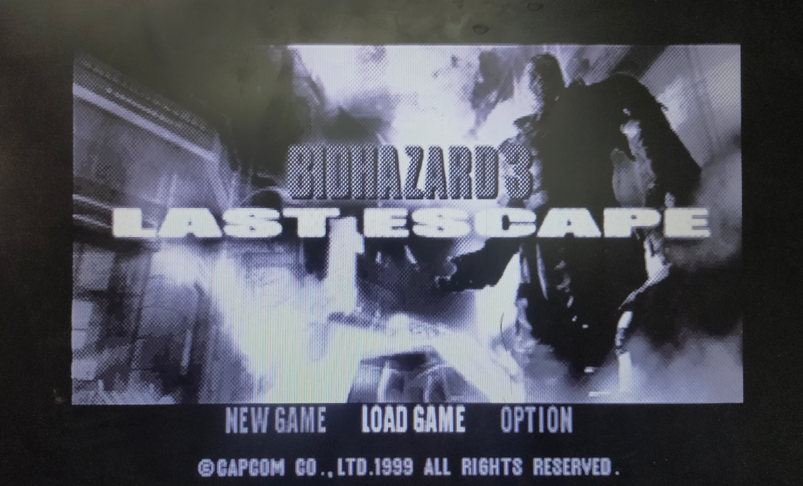

# PSNee V9.0
PSNee is compatible with all retail PlayStation 1 models and various AVR microcontrollers.   

## For all useful information, please consult the [Wiki](https://github.com).

## Features
- **Disc Region Protection:** Removes region locks.
- **BIOS Patching:** Provides enhanced compatibility.
- **Board Support:** Custom boards manager to simplify fuse settings and hardware configuration.

> [!IMPORTANT]
> **Video Signal Note:** This modchip does not handle PAL/NTSC video signal conversion. Playing games from a different region may result in an incorrect display (e.g., NTSC games on early PAL consoles, or PAL games on NTSC-U/C or NTSC-J consoles).
>
> European models from SCPH-5502 to SCPH-9002 typically handle NTSC signals correctly. However, **SCPH-102** requires a BIOS patch to support it.
>
> See the Example of a distorted image at the bottom of the page.

## Supported Hardware (AVR)
- **ATmega328(A/P/PA)** @16MHz  
- **ATmega168(A/P/PA)** @16MHz
- **ATmega32U4** @16MHz
- **ATtiny25/45/85** @8MHz *(No BIOS patch support!)*

> [!CAUTION]
> **SCPH-7000 NTSF J (BIOS Patch & Memory Cards):** 
> On SCPH-7000 models, the BIOS patch has an issue with memory cards. The only way to bypass it is to install a switch on the mod to disable the BIOS patch. This is done according to the available diagram.

---

### Example of a distorted image 
*Typical result when playing a game from a different region without a signal converter.*  

### Verified Hardware (Personal Test Collection)

*From left to right: NTSC-J, PAL, and NTSC-U/C & Asia models.*

