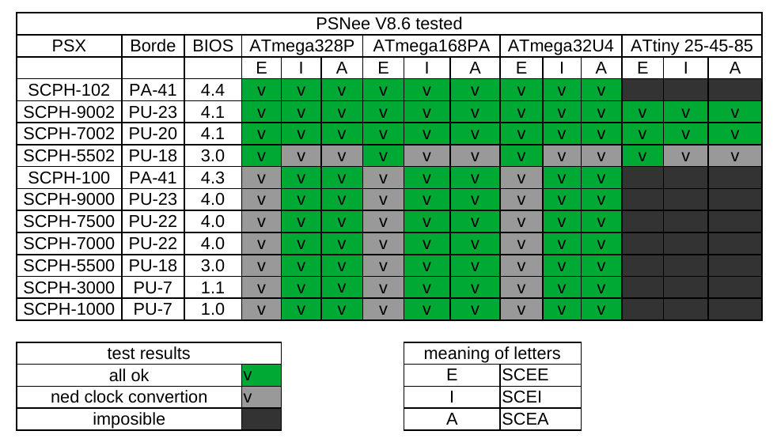

# PSNee V8.7
THE modechip supports the largest number of Playstation 1 variants, and the largest number of microcontrollers
# For all useful information consult the 

## Features
- Remove Disk Region Protection
- Patch BIOS 
- A specific library for card support, to solve the fuse setting problem.
- The mode does not take care of changing PAL <-> NTSC video output (in other words if you use a Japanese console and you put European games, or in older European models you use American or Japanese games... the display will not be correct)

## Supported Playstation 1
All US models, all European models, and the vast majority of Japanese models.

## Supported platforms
- ATmega328(A/P/PA) @16Mhz  
- ATmega168(A/P/PA) @16Mhz
- Atmega32U4        @16Mhz
- ATtiny25/45/85    @8Mhz no BIOS patch!

## Model that I personally tested

Example of gray image  

