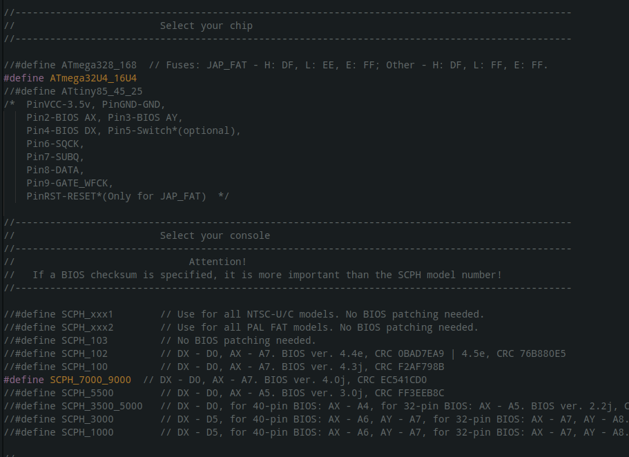

# PSNee V8

The first stealth modchip supporting unlocking BIOS of Japanese versions Sony PlayStation 1

Developed by **brill** & **postal2201**, based on PSNee V7 open source project.  
- http://www.emu-land.net/forum/index.php/topic,85934.0.html

## Supported platforms
PsNee V8 supports the following MCU's:  
- ATmega328(A/P/PA) @16Mhz  
- ATmega168(A/P/PA) @16Mhz  

## Installation
Use the programmer to flash MCU. 
**Flashing via COM port is not supported.**

### Fuses
Before flashing the MCU, you need to configure the fuses.  
- Fuses for JAP_FAT consoles: **H: DF, L: EE, E: FF**  
- Fuses for all other consoles: **H: DF, L: FF, E: FF**  

### Arduino
To install via the Arduino IDE may require the installation of the [MiniCore](https://github.com/MCUdude/MiniCore) package.

Example of correct setting for ATmega328P:\
**Don't use a bootloader!**

After that select the type console - uncoment define in file project(*.ino)

Final step: Sketch -> Upload Using Programmer

## Installation diagram

